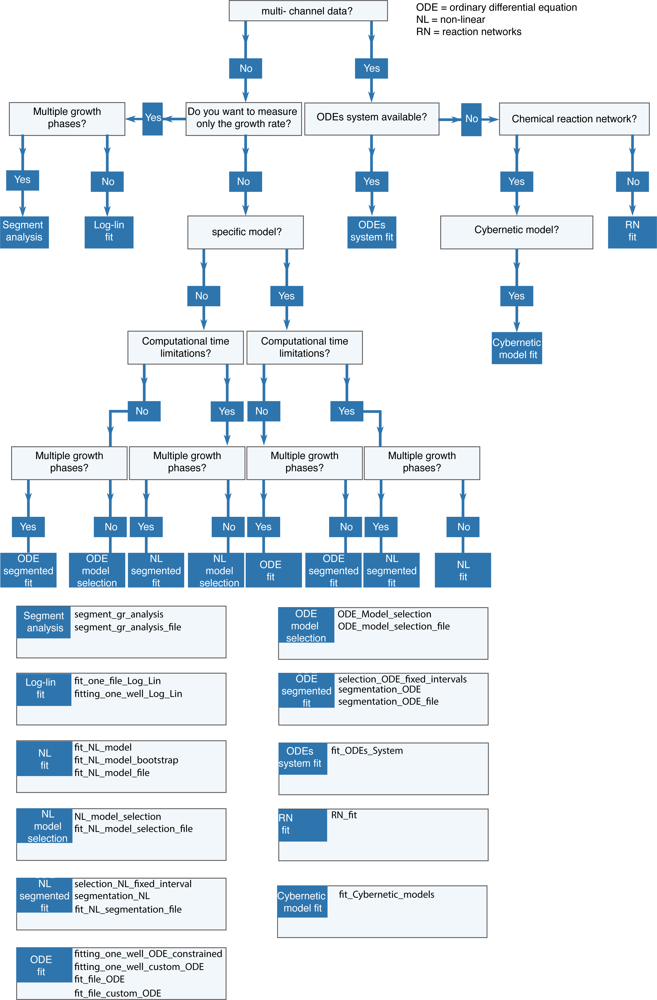

# [Examples of fitting](@id examples)

This section provides some copy-and-paste examples on how to fit kinetics data with Kinbiont.jl. 
These examples can be replicated by running the scripts in the [examples folder](https://github.com/pinheiroGroup/Kinbiont.jl/tree/main/Example_scripts). 
In the [Notebook folder](https://github.com/pinheiroGroup/Kinbiont.jl/tree/main/Notebook_examples), you will find some of these examples and the results.

```@contents
Pages = ["index.md"]
Depth = 4
```

A corse grain description on which function/method to fit can be used is described in the following flow chart:

```@raw html
<div style="text-align: center; margin: auto; max-width: 1000px;">
    
</div>
```


 To run all the examples on this page, you need the following packages:
```julia
using Kinbiont
using CSV
using Plots
using Distributions
using Optimization
using OptimizationNLopt
using NLopt
using Tables
using Random
```


## Fitting a single kinetics

### Simulating Data with ODEs

First, we simulate the data to use them example for the fitting:

```julia
model = "triple_piecewise_adjusted_logistic"
n_start = [0.1]
tstart = 0.0
tmax = 500.0
delta_t = 15.0


param_of_ode = [0.06, 1.0, 200, 0.5, 0.001, 450, -0.0002]
```
Then we call the Kinbiont.jl API:

```julia
sim = Kinbiont.ODE_sim(model, n_start, tstart, tmax, delta_t, param_of_ode)

# Plotting scatterplot of data 
Plots.scatter(sim, xlabel="Time", ylabel="Arb. Units", label=["Data " nothing], color=:blue, size=(300, 300))
```
We add uniform noise to the data
```julia
#adding uniform random noise
noise_unifom = rand(Uniform(-0.05,0.05),length(sim.t))


data_t = reduce(hcat,sim.t)
data_o = reduce(hcat,sim.u)
data_OD = vcat(data_t,data_o)
data_OD[2,:] = data_OD[2,:] .+ noise_unifom
# ploting scatterplot of data with noise

Plots.scatter!(data_OD[1,:],data_OD[2,:], xlabel="Time", ylabel="Arb. Units", label=["Data " nothing],color=:red,markersize =2 ,size = (300,300))

```

When data are stored in a Matrix of Float64 with 2 rows it is possible to perform various analyses
### Evaluation of the dynamics of specific growth rate
The user can evaluate the specific growth rate during the whole curve. This can be done by running the following:


```julia

pt_win = 7
specific_gr_array = Kinbiont.specific_gr_evaluation(data_OD,pt_win )
specific_gr_times = [
    (data_OD[1, r] + data_OD[1, 	(r+pt_smoopt_winthing_derivative)]) / 2 for
    r = 1:1:(eachindex(data_OD[2, :])[end].- pt_win)
 	]
Plots.scatter(specific_gr_times,specific_gr_array, xlabel="Time", ylabel="Arb. Units", label=["Data " nothing],  color=:blue, size = (300,300))


```
### Log-Lin fitting

To perform the log-linear fitting (of data generated in the previous example), it is sufficient to run

```julia
res_log_lin = Kinbiont.fitting_one_well_Log_Lin(
    data_OD, # dataset first row times second row OD
   "test", # name of the well
    "test log-lin fitting"; #label of the experiment
    type_of_smoothing="rolling_avg", # type of smoothing
    pt_avg=7, # number of the point for rolling avg not used in the other cases
    pt_smoothing_derivative=7, # number of poits to smooth the derivative
    pt_min_size_of_win=7, # minimum size of the exp windows in number of smooted points
)
```
 The results are stored in the ```res_log_lin```  data struct. 


###    Fitting ODE Models

Before fitting the model, the initial guess of parameters for the optimization and upper and lower bounds for the ODE parameters are defined :
```julia


model ="aHPM"

p_guess = [0.01, 0.001, 1.00, 1]
ub_ahpm = p_guess.*4
lb_ahpm = p_guess./4
```
The actual fitting is accomplished through the ```fitting_one_well_ODE_constrained``` function.  In this case, we do not use the lb and ub. They will be generated automatically giving a warning
```julia
# Performing ODE fitting
 results_ODE_fit = Kinbiont.fitting_one_well_ODE_constrained(
    data_OD, 
    "test",
    "test_ODE",
    model,
    p_guess;
)
Plots.scatter(data_OD[1,:],data_OD[2,:], xlabel="Time", ylabel="Arb. Units", label=["Data " nothing],color=:red,markersize =2 ,size = (300,300))
Plots.plot!(results_ODE_fit[4],results_ODE_fit[3], xlabel="Time", ylabel="Arb. Units", label=["fit " nothing],color=:red,markersize =2 ,size = (300,300))


```

To add lower and upper bounds one should use the ```opt_params...``` keyword argument:
```julia
# Performing ODE fitting

results_ODE_fit = Kinbiont.fitting_one_well_ODE_constrained(
    data_OD, 
    "test",
    "test_ODE",
    model,
    p_guess;
   lb = lb_ahpm,
   ub = ub_ahpm
)

Plots.scatter(data_OD[1,:],data_OD[2,:], xlabel="Time", ylabel="Arb. Units", label=["Data " nothing],color=:red,markersize =2 ,size = (300,300))
Plots.plot!(results_ODE_fit[4],results_ODE_fit[3], xlabel="Time", ylabel="Arb. Units", label=["fit " nothing],color=:red,markersize =2 ,size = (300,300))


```

To change the optimization method one should call the desired library from Optimization.jl and use the keyword argument ```optimizer``` and if required by the selected optimizer it necessary to specify the differentiation methods, e.g.:


- using Broyden–Fletcher–Goldfarb–Shanno algorithm
```julia

results_ODE_fit = Kinbiont.fitting_one_well_ODE_constrained(
    data_OD, 
    "test",
    "test_ODE",
    model,
    p_guess;
   lb = lb_ahpm,
   ub = ub_ahpm,
   optimizer=BFGS(), 
)
```

- using PRAXIS algorithm, with Tik-Tak restart (from Benchmarking global optimizers, Arnoud et al 2019)

```julia

results_ODE_fit = Kinbiont.fitting_one_well_ODE_constrained(
    data_OD, 
    "test",
    "test_ODE",
    model,
    p_guess;
   lb = lb_ahpm,
   ub = ub_ahpm,
   optimizer=LN_PRAXIS(), 
       multistart = true,
)
```

- Changing the number of iterations and absolute tolerance:

```julia

results_ODE_fit = Kinbiont.fitting_one_well_ODE_constrained(
    data_OD, 
    "test",
    "test_ODE",
    model,
    p_guess;
   lb = lb_ahpm,
   ub = ub_ahpm,
   optimizer= BFGS(), 
   abstol = 0.0001,
   maxiters= 20000,
)
```
###   Custom ODE Fitting

Using the custom ODE fitting, users can fit any ordinary differential equation. First it is necessary to define the differential equation. This is done by declaring a new function, e.g.:
```julia

# Custom ODE function
function ODE_custom(du, u, param, t)
    du[1] = u[1] * (1 - u[1]) * param[2] + param[1] * u[1]
end

```
Now, we set upper and lower bounds of the parameters of the ODE:

```julia
custom_ub = [1.2, 1.1]
custom_lb = [0.0001, 0.00000001]
```
Finally, we perform the fit:
```julia

# Performing custom ODE fitting
results_ODE_fit = Kinbiont.fitting_one_well_custom_ODE(
    data_OD, # dataset first row times second row OD
   "test", # name of the well
    "test custom ode", #label of the experiment
   ODE_custom, #  model to use
   param_guess,
    1; # number  in the system
  )


```

###   ODE Sensitivity Analysis

The sensitivity analysis is performed with the ```one_well_morris_sensitivity``` function. This function takes a preprocessed time series (```data_OD```), the name and label of the well, the ODE model to use ("aHPM" in this case), as well as the lower and upper bounds for the ODE parameters. The number of steps in the Morris method (```n_step_sensitivity```) should be specified.

```julia
# Number of steps for Morris sensitivity analysis
n_step_sensitivity = 5
p_guess = [0.01, 0.001, 1.00, 1]
ub_ahpm = p_guess.*5
lb_ahpm = p_guess./5
# Performing Morris sensitivity analysis
@time sensitivity_test = Kinbiont.one_well_morris_sensitivity(
    data_OD, 
    "test",
     "test_sensitivity",
      "aHPM", 
      lb_ahpm,
       ub_ahpm,
    N_step_morris=n_step_sensitivity ;
)


```
###   ODE Model Selection

The user can use the model selection function to use AIC (or AICc) to identify the best model to fit a specific kinetics.
We start defining the list of the models and the upper and lower bounds of the parameters:

```julia
# Models candidates and their parameter bounds
list_of_models = ["aHPM",   "baranyi_roberts"]
ub_1 =[ 0.1 , 0.1 , 0.1 , 5.001    ]
lb_1 =[ 0.0001 , 0.001,0.0  , 0.001 ]
p1_guess = lb_1 .+ (ub_1.-lb_1)./2

ub_2 =[ 1.2 , 5.1 , 500.0  ,5.0,5.0  ]
lb_2 =[ 0.0001 , 0.1, 0.00 ,0.2,0.2 ]
p2_guess = lb_2 .+ (ub_2.-lb_2)./2


```


The model selection process is runned with the ```ODE_Model_selection``` function. 

```julia
results_ms = Kinbiont.ODE_Model_selection(
    data_OD,
    "test", 
    "test_model_selection",
    list_of_models,
    list_guess;
    multistart = true,
    lb_param_array = list_lb,
    ub_param_array = list_ub  
)

Plots.scatter(data_OD[1,:],data_OD[2,:], xlabel="Time", ylabel="Arb. Units", label=["Data " nothing],color=:red,markersize =2 ,size = (300,300))
Plots.plot!(results_ms[4],results_ms[3], xlabel="Time", ylabel="Arb. Units", label=["fit " nothing],color=:red,markersize =2 ,size = (300,300))


```


The results of the model selection process are stored in the ```results_ms``` variable.

### ODE segmentation
For a single kinetics it is possible to run the segmentaion in two different ways. A manual selection of the change points or a using a change points detection algorithm to find them.

First of all we generate a synthetic daset composed by more than one model  (skip this part if you import a real dataset in the data variable).


```julia
#First segment ODE

model = "logistic"
n_start =[0.1]
tstart =0.0

tmax = 0100.0
delta_t=2.0
param_of_ode= [0.1,0.2]

sim_1 = Kinbiont.ODE_sim(model, #string of the model
    n_start, # starting condition
    tstart, # start time of the sim
    tmax, # final time of the sim
    delta_t, # delta t for poisson approx
    param_of_ode # parameters of the ODE model
)

sol_1 =reduce(vcat,sim_1)

# second segment ODE


model = "logistic"
n_start =[sol_1[end]]
tstart =100.0
tmax = 0200.0
delta_t=2.0
param_of_ode= [0.2,0.5]


sim_2= Kinbiont.ODE_sim(model, #string of the model
    n_start, # starting condition
    tstart, # start time of the sim
    tmax, # final time of the sim
    delta_t, # delta t for poisson approx
    param_of_ode # parameters of the ODE model
)

sol_2 =reduce(vcat,sim_2)
# third segment ODE


model = "logistic"
n_start =[sol_2[end]]
tstart =200.0
tmax = 0300.0
delta_t=2.0
param_of_ode= [0.1,0.9]

sim_3= Kinbiont.ODE_sim(model, #string of the model
    n_start, # starting condition
    tstart, # start time of the sim
    tmax, # final time of the sim
    delta_t, # delta t for poisson approx
    param_of_ode # parameters of the ODE model
)

sol_3 =reduce(vcat,sim_3)
times_sim =vcat(sim_1.t,sim_2.t)
times_sim =vcat(times_sim,sim_3.t)

# binding the simulatios
sol_sim =vcat(sol_1,sol_2)
sol_sim =vcat(sol_sim,sol_3)


Plots.scatter(times_sim,sol_sim, xlabel="Time", ylabel="Arb. Units", label=["Data " nothing],  color=:blue, size = (300,300))


data_OD = Matrix(transpose(hcat(times_sim,sol_sim)))

# Adding uniform noise to the dataset
noise_uniform = rand(Uniform(-0.01, 0.01), length(sol_sim))
data_OD = Matrix(transpose(hcat(times_sim, sol_sim)))
data_OD[2, :] = data_OD[2, :] .+ noise_uniform


```
Then we generate the list of models that will be used and their parameters's lower/upper bounds:

```julia
# Initializing all the models for selection
ub_exp = [0.1]
lb_exp = [-0.01]
p1_guess = lb_exp .+(ub_exp.-lb_exp)/.2

ub_logistic = [0.9, 5.0]
lb_logistic = [0.0001, 0.001]
p2_guess = lb_logistic .+(ub_logistic.-lb_logistic)/.2

ub_hpm = [0.1, 20.0, 50.001]
lb_hpm = [0.0001, 0.000001, 0.001]
p3_guess = lb_hpm .+(ub_hpm.-lb_hpm)/.2


list_of_models = ["exponential",  "logistic","HPM"]
list_ub_param = [ub_exp,ub_logistic, ub_hpm]
list_lb_param = [lb_exp, lb_logistic,lb_hpm]
list_guess = [p1_guess, p2_guess, p3_guess]

```

First, we fit giving to Kinbiont the list of change points:

```julia
seg_fitting = Kinbiont.selection_ODE_fixed_intervals(
   data_OD, # dataset first row times second row OD
    "test", # name of the well
    "", #label of the experiment
    list_of_models, #  models to use
    list_guess,
    cdp_list;
)
Plots.scatter(data_OD[1, :], data_OD[2, :], xlabel="Time", ylabel="Arb. Units", label=["Data " nothing], color=:blue, markersize=2, size=(300, 300))
Plots.plot!(seg_fitting[3], seg_fitting[4], xlabel="Time", ylabel="Arb. Units", label=["fit " nothing], color=:red, markersize=2, size=(300, 300))

```
In alternative, if the change points are not known we can run a cpd algorithm and perfom the fitting with :


```julia
n_change_points =3
seg_fitting = Kinbiont.segmentation_ODE(
   data_OD, # dataset first row times second row OD
    "test", # name of the well
    "", #label of the experiment
    list_of_models, #  models to use
    list_guess,
    n_change_points;
    detect_number_cpd=true,
    fixed_cpd=false,
)

```
### Fitting NL Models
With Kinbiont it is possible to fit any non-linear model this can be done by calling the function ```NL_model_selection``` in different ways.


First, we declare the upper and lower bound and the model (note that in this case, we usean  array of array because the input can be more than one model)

```julia
nl_model = ["NL_Richards"]
p_guess = [[1.0,1.0,0.01,300.0]]
lb_nl =[[0.01,0.01,0.000001,00.01]]
ub_nl =p_guess.*3
```


To perform a single fit on a time series (i.e., ```data_OD```) then we run the following:
```julia
nl_fit = Kinbiont.NL_model_selection(data_OD, # dataset first row times second row OD
"test", 
"test_model_selection",
nl_model, #  model to use
p_guess;
)
```


The user can specify any parameter of the optimizer, for the bound, in this case, it is done via:
```julia
nl_fit =  Kinbiont.NL_model_selection(data_OD, # dataset first row times second row OD
    "test", 
    "test_model_selection",
    nl_model, #  model to use
    p_guess;
    lb_param_array =lb_nl,
    ub_param_array = ub_nl,
    maxiters=2000000,
    abstol=0.00001,
)

```


### NL Sensitivity Analysis

As for the ODE model, also for the NL fit it is possible to perform a sensitivity analysis with respect to the initial starting guess of the parameters, in this case we just use ```method_of_fitting= "Morris_sensitivity"``` and nrep as the number of Morris steps


```julia
nl_fit =  Kinbiont.NL_model_selection(data_OD, # dataset first row times second row OD
"test", 
"test_model_selection",
nl_model, #  model to use
p_guess;
nrep =3,
method_of_fitting ="Morris_sensitivity",
multistart = true,
lb_param_array = lb_nl,
ub_param_array = ub_nl
)

Plots.scatter(data_OD[1,:],data_OD[2,:], xlabel="Time", ylabel="Arb. Units", label=["Data " nothing],color=:red,markersize =2 ,size = (300,300))
Plots.plot!(nl_fit[4],nl_fit[3], xlabel="Time", ylabel="Arb. Units", label=["fit " nothing],color=:red,markersize =2 ,size = (300,300))


```


### NL Model Selection
To perform model selection, we just specify an array with the list of all the used models:
```julia

nl_ub_1 =  [2.0001 , 10.00000001, 500.00]
nl_lb_1 =  [0.0001 , 0.00000001, 0.00 ]
p1_guess = nl_lb_1 .+ (nl_ub_1.-nl_lb_1)./2

nl_ub_2 =  [2.0001 , 10.00000001, 5.00,5.0]
nl_lb_2 =  [0.0001 , 0.00000001, 0.00,0.0 ]
p2_guess = nl_lb_2 .+ (nl_ub_2.-nl_lb_2)./2

nl_ub_3 =  [2.0001 , 10.00000001]
nl_lb_3 =  [0.0001 , 0.00000001]
p3_guess = nl_lb_3 .+ (nl_ub_3.-nl_lb_3)./2

nl_ub_4 =  [2.0001 , 10.00000001, 500.00]
nl_lb_4 =  [0.0001 , 0.00000001, 0.00 ]
p4_guess = nl_lb_4 .+ (nl_ub_4.-nl_lb_4)./2

list_models_f = ["NL_Gompertz","NL_Bertalanffy","NL_exponential","NL_Gompertz"]
list_lb =[nl_lb_1,nl_lb_2,nl_lb_3,nl_lb_4]
list_ub = [nl_ub_1,nl_ub_2,nl_ub_3,nl_ub_4]
list_guess = [p1_guess,p2_guess,p3_guess,  p4_guess]

```
and then we perform the fit:
```julia

results_ms = Kinbiont.NL_model_selection(
    data_OD,
    "test", 
    "test_model_selection",
    list_models_f,
    list_guess;
    lb_param_array = list_lb,
    ub_param_array = list_ub  
)

```

### NL segmentation

As the ODE case, for NL segmentation we can perform a segmente fit with manual selection of the change points or a using a change points detection algorithm to find them.
Note that in the case of the NL fit, the fit of the segment goes backward and since it is not possible to specificy the bounduary condition of the fit the user can force the optimization problem to mantain the continuty between segment with the parameter  ```penality_CI=8.0```. 

We specify the list of used models and parameters bounds:

```julia

ub_1 = [0.3 , 0.1]
lb_1 = [0.01 , -0.01]
p1_guess = lb_1 .+(ub_1.-lb_1)/.2

ub_2 = [1.9, 0.1,500.0]
lb_2 = [0.0001,0.001 ,0.001]
p2_guess = lb_2 .+(ub_2.-lb_2)/.2

ub_3 = [0.1, 1.1, 500.0]
lb_3 = [0.0001, 0.000001, 0.001]
p3_guess = lb_3 .+(ub_3.-lb_3)/.2


list_of_models_nl = ["NL_exponential",  "NL_logistic","NL_Gompertz"]
list_ub_param = [ub_1,ub_2, ub_3]
list_lb_param = [lb_1, lb_2,lb_3]
list_guess = [p1_guess, p2_guess, p3_guess]

```


As before we specify the intervals of the segment and we proceed to fit:


```julia
cdp_list = [100.0, 200.0]

seg_fitting = Kinbiont.selection_NL_fixed_interval(
   data_OD, # dataset first row times second row OD
    "test", # name of the well
    "", #label of the experiment
    list_of_models_nl, #  models to use
    list_guess,
    cdp_list;
    pt_smooth_derivative = 3
)
```
Another option could be to  run a cpd algorithm and perform the fitting:


```julia
n_change_points = 2

seg_fitting = Kinbiont.segmentation_NL(
   data_OD, # dataset first row times second row OD
    "test", # name of the well
    "", #label of the experiment
    list_of_models_nl, #  models to use
    list_guess,
    2;
    detect_number_cpd=true,
    fixed_cpd=false,
    beta_smoothing_ms=2.0, #  parameter of the AIC penality
    correction_AIC=true,
)


```

### Fitting a ODEs System

This example demonstrates how to fit an Ordinary Differential Equations (ODEs) system using Kinbiont. The system models interactions between four variables, and we aim to estimate its parameters from noisy simulated data.

First, we define a custom model (if you want to use a hardcoded model, just put the corresponding string in the model field for the simulation and the fit).
The system consists of:
- **u1**: A reactant influenced by u4.
- **u2**: An intermediate product.
- **u3**: A final product.
- **u4**: A resource that decreases as the reaction proceeds.

The ODE system is defined as:

```julia
using Kinbiont
using Plots
using StatsBase
using Distributions

function model_1(du, u, param, t)
    du[1] = param[1] * u[1] * u[4]                  # Reactant conversion
    du[2] = param[4] * du[1] - param[3] * u[2] - param[2] * u[2]  # Intermediate balance
    du[3] = param[3] * u[2] - param[2] * u[3]       # Final product formation
    du[4] = -du[1]                                  # Resource consumption
end
```

We define initial conditions, true parameters, and the bounds of the fit:

```julia
u0 = [0.1, 0.0, 0.0, 1.0]  # Initial conditions for [u1, u2, u3, u4]
param = [0.1, 0.01, 0.5, 0.42]  # True parameter values

lb1 = [0.01, 0.0001, 0.0, 0.01]  # Lower bounds
ub1 = [0.2, 0.3, 1.1, 1.0]       # Upper bounds
param_guess = lb1 .+ (ub1 .- lb1) ./ 2  # Initial parameter guess
```
We simulate the data

```julia
Simulation = ODEs_system_sim(
    model_1, # ODE function
    u0,      # Initial conditions
    0.0,     # Start time
    50.0,    # End time
    1.0,     # Time step for Poisson approximation
    param    # True parameters
)
```
We add some uniform noise

```julia
sol_time = reduce(hcat, Simulation.t)
sol_t = reduce(hcat, Simulation.u)

# Adding uniform random noise
sol_t_noise = [sol_t[i, :] .+ rand(Uniform(-0.05, 0.05), size(sol_t)[2]) for i in 1:size(sol_t)[1]]
sol_t_noise = permutedims(reduce(hcat, sol_t_noise))

data = vcat(sol_time, sol_t_noise)
```
We plot the data with noise:

```julia
display(scatter(data[1, :], data[2, :], label="u1"))
display(scatter!(data[1, :], data[3, :], label="u2"))
display(scatter!(data[1, :], data[4, :], label="u3"))
display(scatter!(data[1, :], data[5, :], label="u4"))
```

We Fit the Model Using Kinbiont

```julia
fit = fit_ODEs_System(
    data,
    "test",     # Label for dataset
    model_1,    # ODE model
    param_guess, # Initial parameter guess
    u0;         # Initial conditions
    lb=lb1,     # Lower bounds
    ub=ub1      # Upper bounds
)
```

We plot the fitted model
```julia
plot!(fit[3], label="Fitted Model")
```


### Fitting reaction network


We define a **Michaelis-Menten enzyme kinetics** reaction network using [Catalyst](https://docs.sciml.ai/Catalyst/stable/) :

```julia
# Define initial conditions
u0 = [:S => 301, :E => 100, :SE => 0, :P => 0]

# Define kinetic parameters
ps = [:kB => 0.00166, :kD => 0.0001, :kP => 0.1]

# Define the Michaelis-Menten reaction network
model_Michaelis_Menten = @reaction_network begin
    kB, S + E --> SE
    kD, SE --> S + E
    kP, SE --> P + E
end
```

We simulate the reaction system over a time range (`t=0` to `t=10`) using Kinbiont's reaction network simulation function:

```julia
# Run simulation
Simulation = Kinbiont.Kinbiont_Reaction_network_sim(
    "Michaelis_Menten",
    u0,
    0.0, 10.0, 0.1, # Start time, end time, step size
    ps
)

# Plot the simulation results
plot(Simulation)
```

We introduce synthetic noise to the simulated data to mimic experimental uncertainty:

```julia
# Extract time-series data from the simulation
sol_time = reduce(hcat, Simulation.t)
sol_t = reduce(hcat, Simulation.u)

# Add noise to the dataset
noise = rand(Uniform(-0.01, 0.05), size(sol_t))
sol_t_noise = sol_t .+ noise

# Prepare noisy data for fitting
data = vcat(sol_time, permutedims(sol_t_noise))
```

We plot the data

```julia
# Scatter plot of noisy data
scatter(data[1, :], data[2, :], label="S")
scatter!(data[1, :], data[3, :], label="E")
scatter!(data[1, :], data[4, :], label="SE")
scatter!(data[1, :], data[5, :], label="P")
```

We use `RN_fit` to estimate the reaction parameters from the noisy dataset:

```julia
# Fit the model to noisy data
fit = RN_fit(data, model_Michaelis_Menten, u0, ps)

# Overlay the fitted model on the original plot
plot!(fit[4])
```


### Fitting a cybernetic models


We define a Kinbiont Cybernetic Model with specific parameters:

```julia
# We import the Kinbiont_Cybernetic_Model class from the Kinbiont module
import Kinbiont.Kinbiont_Cybernetic_Model
# Define the Cybernetic Model
model = Kinbiont_Cybernetic_Model(
    Bio_mass_conc = 1.01,  # Initial biomass concentration
    Substrate_concentrations = [5.0, 5.0],  # Concentrations of 2 substrates
    Protein_concentrations = [0.0, 0.0],  # Initial protein concentrations
    allocation_rule = threshold_switching_rule,  # Dynamic resource allocation rule
    reaction = nothing,  # No specific reaction function provided
    cost = nothing,  # No cost function
    protein_thresholds = 0.01,  # Protein activation threshold
    a = [0.1, 0.4],  # Synthesis rate constants for proteins
    b = [0.00001, 0.000001],  # Degradation constants for proteins
    V_S = [0.7, 0.1],  # Substrate utilization rates
    k_S = [0.1, 0.11],  # Saturation constants for substrates
    Y_S = [0.07, 0.11]  # Yield coefficients for biomass per substrate
)
```


We simulate the model over time (from `t=0` to `t=100`) using the `Tsit5` solver:

```julia
# Simulate the model
simulation = Kinbiont_Cybernetic_Model_simulation(model, 0.0, 100.0, 0.1; Integration_method = Tsit5())

# Plot the results
plot(simulation)
```


We extract the simulation data (biomass, substrate, and protein concentrations over time) for fitting:

```julia
# Extract time-series data from the simulation
prob = simulation.prob

data_to_fit = hcat(prob.t, reduce(hcat, prob.u)[1,:])
data_to_fit = hcat(data_to_fit, reduce(hcat, prob.u)[2,:])
data_to_fit = hcat(data_to_fit, reduce(hcat, prob.u)[3,:])
data_to_fit = hcat(data_to_fit, reduce(hcat, prob.u)[4,:])
data_to_fit = hcat(data_to_fit, reduce(hcat, prob.u)[5,:])
data_to_fit = permutedims(data_to_fit)  # Convert to column-major order
```


We define a new model where some parameters (`a`, `V_S`)  are unknown and need to be fitted, to do that, we put them to nothing in the data struct:

```julia
# Define a new model with unknown parameters
model_fit = Kinbiont_Cybernetic_Model(
    Bio_mass_conc = 1.01,  # Initial biomass concentration
    Substrate_concentrations = [2.0, 5.0],  # Initial substrate concentrations
    Protein_concentrations = [0.0, 0.0],  # No initial protein concentrations
    allocation_rule = proportional_allocation_rule,  # Different allocation rule
    reaction = nothing,  # No specific reaction function
    cost = nothing,  # No cost function
    protein_thresholds = 0.01,  # Protein activation threshold
    a = [nothing, 0.1],  # One synthesis rate is unknown
    b = [0.00001, 0.000001],  # Known degradation constants
    V_S = [nothing, 0.4],  # One substrate utilization rate is unknown
    k_S = [0.1, 0.11],  # Saturation constants
    Y_S = [0.07, 0.11]  # Yield coefficients
)
```

Using `fit_Cybernetic_models`, we fit the model parameters to experimental data:

```julia
# Fit the model to experimental data
results = fit_Cybernetic_models(
    data_to_fit,  # Experimental data
    "test",  # Dataset name
    model_fit,  # Model with unknown parameters
    [0.01, 0.1];  # Initial guesses for unknown parameters (a and V_S)
    set_of_equations_to_fit = nothing  # No additional constraints
)
```


## Fitting a .csv file

Instead of fitting a single kinetics, the user can supply a `.csv` file (formatted as described in the section), and Kinbiont will proceed to perform the analysis on all the wells of the experiment. Note that the user can supply an annotation .csv. In this case, it becomes possible to subtract the blanks and fit the average of replicates.

Note that this is aviable only for ODE with one dimensional data (OD or biomass). For use a `.csv` with multidimensional ODEs you need import the data and shape them in the format required by Kinbiont. 
To use the following functions, the user should input Kinbiont variables that contain the string of the path to the .csv files:

```julia
path_to_data = "your_path/data_examples/plate_data.csv"
path_to_annotation ="your_path_to_annotation/annotation.csv"
```
In the following examples, we assume that these two variables have a value. You can use the file in the folder (data examples)[https://github.com/pinheiroGroup/Kinbiont.jl/tree/main/data_examples].
Note that if you use the following function you can use the package https://github.com/pinheiroGroup/KinbiontPlots.jl to display or save the plots of the fit for all the wells in the experiment. This can be done using the following function with input of the data struct coming for any fit:

```julia
using KinbiontPlots

plot_fit_of_file(
    Kinbiont_results;
    path_to_plot="NA", # path where to save Plots
    display_plots=true,# display plots in julia or not
    save_plots=false, # save the plot or not
    x_size=500,
    pt_smoothing_derivative = 7,
    y_size =750,
    guidefontsize=18,
    tickfontsize=16,
    legendfontsize=10,
)

```


### Log-Lin fitting

If the paths are provided  to fit, you need just to call ```fit_one_file_Log_Lin``` to use all the default parameters:

```julia
fit_log_lin = Kinbiont.fit_one_file_Log_Lin(
    "test", #label of the experiment
    path_to_data; # path to the folder to analyze
    path_to_annotation=path_to_annotation,# path to the annotation of the wells
  )
```


### ODE fitting
We declare the model and the bounds of it:

```julia


model ="aHPM"
# Upper bounds of the parameters of the ODE
ub_ahpm = [1.2, 1.1, 2.0, 20]

# Lower bounds of the parameters of the ODE
lb_ahpm = [0.0001, 0.00000001, 0.00, 0]
```

We proceed fitting with the ```fit_file_ODE```  function:

```julia


model = "baranyi_richards"

lb_param = [0.001,0.1,0.0,0.01]
ub_param =[0.1,5.0 ,1000.0,5.01]
param_guess =[0.01,1.0 ,500.0,1.01]

fit_od = Kinbiont.fit_file_ODE(
    "test", #label of the experiment
    path_to_data, # path to the folder to analyze
    model, # string of the used model
    param_guess;
    path_to_annotation=path_to_annotation,# path to the annotation of the wells
    lb = lb_param, 
    ub =ub_param,
)

```


It is also possible to perform the model selection on an entire file. First, we declare the list of the models:

```julia
model_1 = "baranyi_richards"

lb_param_1 = [0.001,    0.1 , 0.0   , 0.01]
ub_param_1 = [0.1  ,    5.0 , 1000.0, 5.01]
param_guess_1 =[0.01,1.0 ,500.0,1.01]


model_2 = "aHPM"

lb_param_2 = [0.001,0.0001,0.01,0.01]
ub_param_2 =[0.1,0.1 ,2.0,5.01]
param_guess_2 =[0.01,0.01 ,1.0,1.01]

list_of_models = [model_1,  model_2]
list_ub_param = [ub_param_1,ub_param_2]
list_lb_param = [lb_param_1, lb_param_2]
list_guess = [param_guess_1, param_guess_2]

```
After, we run the function ```ODE_model_selection_file```:

```julia

ms_file = Kinbiont.ODE_model_selection_file(
    "test", #label of the experiment
    path_to_data, # path to the folder to analyze
    list_of_models, #  model to use 
    list_guess;
    lb_param_array=list_lb_param, # lower bound param
    ub_param_array=list_ub_param, # upper bound param
    path_to_annotation=path_to_annotation,# path to the annotation of the wells
)
```

### Fitting NL Models


The user can fit any NL model by calling the function ```fit_NL_model_selection_file```.
As usual, the user should declare the model and the bounds.


We declare the model and the bounds:
```julia
nl_model = ["NL_Richards"]
p_guess = [[1.0,1.0,0.01,300.0]]
lb_nl =[[0.01,0.01,0.000001,00.01]]
ub_nl =p_guess.*50

```
and then fit:
```julia
fit_nl = Kinbiont.fit_NL_model_selection_file(
    "TEST", #label of the experiment
    path_to_data    , # path to the folder to analyze
    nl_model, #  model to use
    p_guess;# initial guess param
    lb_param_array =lb_nl, # lower bound param
    ub_param_array = ub_nl, # upper bound param
    path_to_annotation = path_to_annotation,# path to the annotation of the wells
)

```
The user can perform a NL model selection. To do that, we should start declaring the list of models and upper/lower bounds:


```julia


nl_model = ["NL_Richards","NL_Bertalanffy"]
p_guess = [[1.0,1.0,0.01,300.0],[0.08,1.0,0.01,1.0]]
lb_nl =[[0.01,0.01,0.000001,00.01],[0.00,0.01,0.001,00.01]]
ub_nl =p_guess.*50

```
and the we can call the NL model selection function:

```julia
fit_nl = Kinbiont.fit_NL_model_selection_file(
    "TEST", #label of the experiment
    path_to_data, # path to the folder to analyze
    nl_model, #  model to use
    p_guess;# initial guess param
    lb_param_array =lb_nl, # lower bound param
    ub_param_array = ub_nl, # upper bound param
    path_to_annotation = path_to_annotation,# path to the annotation of the wells
  
)
```

### ODE segmentation

It is possible to apply the ODE segmentation to the an entire .csv file. Note that in this case all the change points will be detectec using a off-line change point algorithm.

First, we declare the models and upper/lower bounds:
```julia
model_1 = "baranyi_richards"

lb_param_1 = [0.001,    0.1 , 0.0   , 0.01]
ub_param_1 = [0.1  ,    5.0 , 1000.0, 5.01]
param_guess_1 =[0.01,1.0 ,500.0,1.01]


model_2 = "aHPM"

lb_param_2 = [0.001,0.0001,0.01,0.01]
ub_param_2 =[0.1,0.1 ,2.0,5.01]
param_guess_2 =[0.01,0.01 ,1.0,1.01]

list_of_models = [model_1,  model_2]
list_ub_param = [ub_param_1,ub_param_2]
list_lb_param = [lb_param_1, lb_param_2]
list_guess = [param_guess_1, param_guess_2]

```

Finally, we perform the fit using one changepoint:
```julia
n_change_points = 1
segmentation_file =  Kinbiont.segmentation_ODE_file(
    " ", #label of the experiment
    path_to_data, # path to the folder to analyze
    list_of_models, #  model to use 
    list_guess, #  param
    n_change_points;
    path_to_annotation=path_to_annotation,# path to the annotation of the wells
    detect_number_cpd=false,
    fixed_cpd=true,
    type_of_curve="deriv",
    win_size=7, # numebr of the point to generate intial condition
     maxiters =5,
    lb_param_array=list_lb_param, # lower bound param
    ub_param_array=list_ub_param, # upper bound param
)
```

### NL segmentation

It is possible to apply the NL segmentation to an entire .csv file. Note that in this case, all the change points will be detected using an offline change point algorithm.

We start declaring models and upper/lower bounds:

```julia

nl_model = ["NL_Richards","NL_Bertalanffy"]
p_guess = [[1.0,1.0,0.01,300.0],[0.08,1.0,0.01,1.0]]
lb_nl =[[0.01,0.01,0.000001,00.01],[0.00,0.01,0.001,00.01]]
ub_nl =p_guess.*50
n_change_points =2
```

Then, we call the function to perform the fit:
```julia
n_change_points = 1
NL_segmentation = Kinbiont.fit_NL_segmentation_file(
    "test", #label of the experiment
    path_to_data, # path to the folder to analyze
    nl_model, #  model to use
    p_guess,# initial guess param
    n_change_points;
    lb_param_array=lb_nl, # lower bound param
    ub_param_array=ub_nl, # upper bound param
    path_to_annotation = path_to_annotation,# path to the annotation of the wells
)
```


## Error functions
The user can choose to use different error functions to perform the fitting. Each fitting API has its keyword argument to change the loss. The possible options are described in the following section.

In the  equations of this list, the notation is the following: $n$ the number of time points $t_i$, $\hat{N}(t_i, \{P\})$ is the proposed numerical solution at time $t_i$ and using the parameters $\{P\}$, and $N(t_i)$ is the data value at $t_i$.

`"L2"`: Minimize the L2 norm of the difference between the numerical solution of the desired model and the given data.

$$\mathcal{L}(\{P\}) = \frac{1}{n} \sum_{i=1}^n \left(N(t_i) - \hat{N}(t_i, \{P\})\right)^2$$


`"RE"`: Minimize the relative error between the solution and data.

$$\mathcal{L}(\{P\}) = \frac{1}{n} \sum_{i=1}^n 0.5 \, \left(1 - \frac{D(t_i)}{\hat{N}(t_i, \{P\})}\right)^2$$


`"L2_derivative"`: Minimize the L2 norm of the difference between the specific growth rate of the numerical solution of the desired model and the corresponding derivatives of the data.

$$\mathcal{L}(\{P\}) = \frac{1}{n} \sum_{i=1}^n \left(\frac{dD(t_i)}{dt} - \frac{d\hat{N}(t_i, \{P\})}{dt}\right)^2$$


`"blank_weighted_L2"`: Minimize a weighted version of the L2 norm, where the difference between the solution and data is weighted based on a distribution obtained from empirical blank data.

$$\mathcal{L}(\{P\}) = \frac{1}{n} \sum_{i=1}^n \left(1 - P(N(t_i) - \hat{N}(t_i, \{P\})|\text{noise})\right) \, \left(N(t_i) - \hat{N}(t_i, \{P\})\right)^2$$

where $P(N(t_i) - \hat{N}(t_i, \{P\})|\text{noise})$ is the probability distribution of the empirical blank data.
`"L2_log"`: Minimize the logarithm of the L2 norm of the difference between the numerical solution of the desired model and the given data.

$$\mathcal{L}(\{P\}) = \log\left(\frac{1}{n} \sum_{i=1}^n \left(N(t_i) - \hat{N}(t_i, \{P\})\right)^2\right)$$


`"RE_log"`: Minimize the logarithm of the relative error between the solution and data.

$$\mathcal{L}(\{P\})= \log\left(\frac{1}{n} \sum_{i=1}^n 0.5 \, \left(1 - \frac{D(t_i)}{\hat{N}(t_i, \{P\})}\right)^2\right)$$


`"L2_std_blank"`: Minimize the L2 norm of the difference between the numerical solution of the desired model and the data, normalized by the standard deviation of empirical blank data.

$$\mathcal{L}(\{P\}) = \frac{1}{n} \sum_{i=1}^n \left(\frac{N(t_i) - \hat{N}(t_i, \{P\})}{\text{std}_{\text{blank}}}\right)^2$$

where $\text{std}_{\text{blank}}$ is the standard deviation of the empirical blank data.

Note that for multidimesional ODEs system for the moment is only supported L2 distance other metrics are in work in progress.
