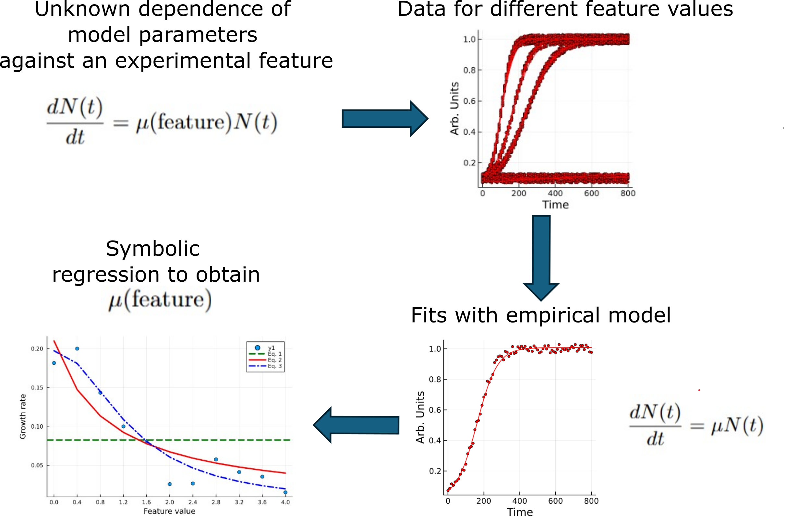

# [Examples of ML analysis](@id examples)

This section provides some copy-and-paste examples of Kinbiont.jl

```@contents
Pages = ["index.md"]
Depth = 3
```

## Symbolic regression detection of laws

In this section we present different example of how to use symbolic regression.

To run these examples, you will need the following packages:

```julia
using DifferentialEquations
using CSV
using SymbolicRegression
using Plots
using StatsBase
using Distributions
```
### Symbolic regression detection of laws: synthetic data example

In this example, we simulate data for a single species. The growth rate depends on an experimental feature, and we assume the user does not know the exact relationship between this feature and the growth rate but it can manipulate and register the value of this feature.
We conduct the experiment under different conditions and fit the data using a simple ODE model.
Afterward, we apply symbolic regression between the experimental feature and the fitted growth rates the to discover the the relationship.
This workflow can be represented by the following diagram:


```@raw html
<div style="text-align: center; margin: auto; max-width: 1000px;">
    
</div>
```

The function `unknown_response` defines the relationship between the experimental feature and the growth rate, where the growth rate is altered as a function of the feature.

```julia
function unknown_response(feature)
    response = 1 / (1 + feature)
    return response
end
```


We use the `baranyi_richards` ODE model in this example. First, we define the parameter ranges and the inital guess  for the fit:

```julia
ODE_models = "baranyi_richards"

# Parameter bounds and initial guess
ub_1 = [0.2, 5.1, 500.0, 5.0]
lb_1 = [0.0001, 0.1, 0.00, 0.2]
p1_guess = lb_1 .+ (ub_1 .- lb_1) ./ 2
```

Next, we define the feature range and simulation parameters:

```julia
# Range of experimental feature
feature_range = 0.0:0.4:4.0

# Simulation parameters
p_sim = [0.1, 1.0, 50.0, 1.0]
psim_1_0 = p_sim[1]

# Time range for simulation
t_min = 0.0
t_max = 800.0
n_start = [0.1]  # Initial population size
delta_t = 5.0  # Time step
noise_value = 0.02  # Noise for simulation
```


We loop through different feature values, modify the growth rate according to the `unknown_response`, and run the simulation. We also add noise to the simulated data.

```julia
# plot to clean the display 
plot(0, 0)
# for over the generated feature values
for f in feature_range
    # Modify the parameter for the current feature
    p_sim[1] = psim_1_0 * unknown_response(f)

    # Run the simulation with Kinbiont
    sim = Kinbiont.ODE_sim("baranyi_richards", n_start, t_min, t_max, delta_t, p_sim)

    # Adding uniform noise
    noise_uniform = rand(Uniform(-noise_value, noise_value), length(sim.t))

    # Collecting the simulated data
    data_t = reduce(hcat, sim.t)
    data_o = reduce(hcat, sim.u)
    data_OD = vcat(data_t, data_o)
    data_OD[2, :] = data_OD[2, :] .+ noise_uniform

    # Plot the data with noise
    display(Plots.scatter!(data_OD[1, :], data_OD[2, :], xlabel="Time", ylabel="Arb. Units", label=nothing, color=:red, markersize=2, size=(300, 300)))

    # Fit the ODE model to the data
    results_ODE_fit = fitting_one_well_ODE_constrained(
        data_OD,
        string(f),
        "test_ODE",
        "baranyi_richards",
        p1_guess;
        lb=lb_1,
        ub=ub_1
    )

    display(Plots.plot!(results_ODE_fit[4], results_ODE_fit[3], xlabel="Time", ylabel="Arb. Units", label=nothing, color=:red, markersize=2, size=(300, 300)))

    # Collect the fitted results for later use
    if f == feature_range[1]
        results_fit = results_ODE_fit[2]
    else
        results_fit = hcat(results_fit, results_ODE_fit[2])
    end
end
```

We now perform symbolic regression to discover the relationship between the feature and the effective growth rate. We set up the options for symbolic regression and generate a feature matrix based on the `feature_range`.

```julia
# Symbolic regression options
options = SymbolicRegression.Options(
    binary_operators=[+, /, *, -],
    unary_operators=[],
    constraints=nothing,
    elementwise_loss=nothing,
    loss_function=nothing,
    tournament_selection_n=12,
    tournament_selection_p=0.86,
    topn=12,
    complexity_of_operators=nothing,
    complexity_of_constants=nothing,
    complexity_of_variables=nothing,
    parsimony=0.05,
    dimensional_constraint_penalty=nothing,
    alpha=0.100000,
    maxsize=10,
    maxdepth=nothing
)

# Generating the feature matrix
feature_matrix = [[string(f), f] for f in feature_range]
feature_matrix = permutedims(reduce(hcat, feature_matrix))

# Performing symbolic regression
gr_sy_reg = Kinbiont.downstream_symbolic_regression(results_fit, feature_matrix, 4; options=options)

# Plot the growth rate with symbolic regression results
scatter(results_fit[2, :], results_fit[4, :], xlabel="Feature value", ylabel="Growth rate")
hline!(unique(gr_sy_reg[3][:, 1]), label=["Eq. 1" nothing], line=(3, :green, :dash))
plot!(unique(results_fit[2, :]), unique(gr_sy_reg[3][:, 2]), label=["Eq. 2" nothing], line=(3, :red))
plot!(unique(results_fit[2, :]), unique(gr_sy_reg[3][:, 3]), label=["Eq. 3" nothing], line=(3, :blue, :dashdot))
```


The unkwon function can be definde in different ways, for example a quadratic function: 

```julia
function unknown_response(feature)
    response = (1 - feature)^2
    return response
end
```
### Symbolic regression detection of laws: detection of Monod law on real data

In this example we replicate the detection of the Monod law on real data presented in the Kinbiont paper. First we set up the paths of the data and where to save the results:

```julia
path_to_data = "your_path/data_examples/plate_data.csv"
path_to_annotation = "your_path/data_examples/annotation.csv"
path_to_calib = "your_path/data_examples/cal_curve_example.csv"
path_to_results = "your_path//seg_res/"
```

We fit the data with  segmentation and 1 change point, this is done to discard from the fitting procedure the sub exponetial growth that appears during the stationary phase. First, we declare the models

```julia
model1 = "HPM_exp"
lb_param1 = [0.00001, 0.000001]
ub_param1 = [0.5, 1.5]
param_guess1 = [0.01, 0.01]

model2 = "logistic"
lb_param2 = [0.00001, 0.000001]
ub_param2 = [0.5, 2.5]
param_guess2 = [0.01, 1.01]

list_of_models = [model1, model2]
list_guess = [param_guess1, param_guess2]
list_lb = [lb_param1, lb_param2]
list_ub = [ub_param1, ub_param2]

n_change_points =1
```

We perform  the fitting, also applying a multiple scattering correction (the file to do that should be calibrated on your instrument) :

```julia
fit_file = Kinbiont.segmentation_ODE_file(
    "seg_exp_1", # Label of the experiment
    path_to_data, # Path to the folder to analyze
    list_of_models, # ODE models to use
    list_guess, # Parameter guesses
    n_change_points;
    path_to_annotation=path_to_annotation, # Path to the annotation of the wells
    detect_number_cpd=false,
    fixed_cpd=false,
    path_to_calib=path_to_calib,
    multiple_scattering_correction=false, # If true, use calibration curve for data correction
    type_of_curve="deriv",
    pt_smooth_derivative=10,
    type_of_smoothing="lowess",
    verbose=true,
    write_res=false,
    path_to_results=path_to_results,
    win_size=12, # Number of points to generate initial condition
    smoothing=true,
    lb_param_array=list_lb, # Lower bounds for parameters
    ub_param_array=list_ub, # Upper bounds for parameters
    maxiters=200000
)
```
We load the annotation and  select results of a specific strain

```julia
annotation_test = CSV.File(path_to_annotation, header=false)
names_of_annotation = propertynames(annotation_test)
feature_matrix = hcat(annotation_test[:Column1], annotation_test[:Column3])

# Selecting strain S5
index_strain = findall(annotation_test[:Column2] .== "S5")
index_cc = findall(annotation_test[:Column3] .> 0.01)
to_keep = intersect(index_strain, index_cc)
feature_matrix = feature_matrix[to_keep, :]
wells_to_use = feature_matrix[:, 1]
index_res = Any

```

We give same order to the well to analyze and the features (can be skipped)
```julia
for i in wells_to_use
    if i == wells_to_use[1]
        index_res = findfirst(res_first_seg[:, 1:end] .== i)
    else
        index_res = hcat(index_res, findfirst(res_first_seg[:, 1:end] .== i))
    end
end

iii = [index_res[1, i][2] for i in eachindex(index_res[1, :])]
res_first_seg_ML = res_first_seg[:, iii]
res_first_seg_ML = hcat(res_first_seg[:, 1], res_first_seg_ML)
```

We add x = 0.0, y = 0.0 to data to take in consideration  not growing wells:

```julia

feature_matrix =vcat(feature_matrix,["zero" 0.0])
res_first_seg_ML=hcat(res_first_seg_ML , reduce(vcat,["zero" ,"zero", "zero", 0.0 ,  0.0 ,0.0 ,0.0 ,0.0 ,0.0 ]))


```

We Declare the options of symbolic regression:

```julia

options = SymbolicRegression.Options(
    binary_operators=[+, /, *, -],
    unary_operators=[],
    constraints=nothing,
    elementwise_loss=nothing,
    loss_function=nothing,
    tournament_selection_n=12,
    tournament_selection_p=0.86,
    topn=12,
    complexity_of_operators=nothing,
    complexity_of_constants=nothing,
    complexity_of_variables=nothing,
    parsimony=0.05,
    dimensional_constraint_penalty=nothing,
    alpha=0.100000,
    maxsize=10,
    maxdepth=nothing
)
```

We run the symbolic regression using dependent variable that is the 7th row of the Kinbiont results (i.e., the growth rate)

```julia

gr_sy_reg = Kinbiont.downstream_symbolic_regression(res_first_seg_ML, feature_matrix, 7; options=options)

scatter(feature_matrix[:, 2], res_first_seg_ML[7, 2:end], xlabel="Amino Acid concentration μM", ylabel="Growth rate [1/Min]", label=["Data" nothing])
hline!(unique(gr_sy_reg[3][:, 1]), label=["Eq. 1" nothing], line=(3, :green, :dash))
plot!(unique(convert.(Float64, feature_matrix[gr_sy_reg[4], 2])), unique(gr_sy_reg[3][:, 2]), label=["Eq. 2" nothing], line=(3, :red))
plot!(unique(convert.(Float64, feature_matrix[gr_sy_reg[4], 2])), unique(gr_sy_reg[3][:, 3]), label=["Eq. 3" nothing], line=(3, :blue, :dashdot))
plot!(unique(convert.(Float64, feature_matrix[gr_sy_reg[4], 2])), unique(gr_sy_reg[3][:, 4]), label=["Eq. 4" nothing], line=(2, :black))
plot!(unique(convert.(Float64, feature_matrix[gr_sy_reg[4], 2])), unique(gr_sy_reg[3][:, 5]), label=["Eq. 5" nothing], line=(2, :black))

```


## Decision tree regression

To run these examples, you will need the following Julia packages:

```julia
using Kinbiont
using Plots
using StatsBase
using Distributions
using Random
# packages to plot the tree if you do not want a plot you can skip
using AbstractTrees
using MLJDecisionTreeInterface
using TreeRecipe
using DecisionTree
```
###  Decision tree regression: reconstruction of antibiotics effects table
In this example, we explore how **Kinbiont.jl** can be used to simulate data about a species exposed to various antibiotics, both individually and in combination. 
We then apply a decision tree regression model to predict the growth rate of the species based on the antibiotics present in the media.
This procedure in theory permits users to retrive the "table of the effects" of the antibiotic combinations, this can be depicted with the following diagram: 

```@raw html
<div style="text-align: center;  margin: auto; max-width: 1000px;">
    
</div>
```


We define a transformation function that modifies the growth rate (`mu`) of the species depending on the antibiotics present in the media. This function uses a predefined concentration map:

```julia
function transform_abx_vector(input_vector::Vector, mu::Float64)
    concentration_map = Dict(
        (1, 0, 0) => 1.0 ,    # abx_1 -> μ
        (0, 1, 0) => 0.5 ,    # abx_2 -> 0.5μ
        (0, 0, 1) => 0.3 ,    # abx_3 -> 0.3μ
        (1, 1, 0) => 0.0 ,    # abx_1 + abx_2 -> 0μ
        (1, 0, 1) => 0.3 ,    # abx_1 + abx_3 -> 0.3μ
        (0, 1, 1) => 0.0 ,    # abx_2 + abx_3 -> 0μ
        (1, 1, 1) => 0.0,     # abx_1 + abx_2 + abx_3 -> 0.0μ
        (0, 0, 0) => 1.0      # No antibiotics -> 1.0μ
    )

    mu_correct = concentration_map[Tuple(input_vector[2:end])] * mu   # Default to 0μ if not found
    return mu_correct
end
```


The concentration map defines how the growth rate (`mu`) is modified for different combinations of antibiotics. Here is a table of the concentration values used in the simulation:

| Antibiotic 1 | Antibiotic 2 | Antibiotic 3 | Growth Rate Scaling (μ) |
|--------------|--------------|--------------|-----------------|
| 1            | 0            | 0            | 1.0             |
| 0            | 1            | 0            | 0.5             |
| 0            | 0            | 1            | 0.3             |
| 1            | 1            | 0            | 0.0             |
| 1            | 0            | 1            | 0.3             |
| 0            | 1            | 1            | 0.0             |
| 1            | 1            | 1            | 0.0             |
| 0            | 0            | 0            | 1.0             |


We generate a random binary matrix representing the combinations of antibiotics present in each experiment and we set simulation parameters.

```julia
# Generate random antibiotic combinations
cols = 3
n_experiment = 100
random_matrix = rand(0:1, n_experiment, cols)
labels = string.(1:1:n_experiment)
random_matrix = hcat(labels, random_matrix)

# Define parameters for simulation
p_sim = [0.05, 1.0, 50.0, 1.0]
psim_1_0 = p_sim[1]
p1_array = [transform_abx_vector(random_matrix[f, :], psim_1_0) for f in 1:size(random_matrix)[1]]

# Simulation settings
t_min = 0.0
t_max = 800.0
n_start = [0.1]
delta_t = 10.0
noise_value = 0.03

plot(0, 0)
```
We initialize the model, the guess, and the bounds to fit and the array to store the results:

```julia
# We initialize the array for the results
results_fit = Any

# We initialize the model, the guess, and the bounds to fit

ODE_models = "baranyi_richards"

ub_1 = [0.2, 5.1, 500.0, 5.0]
lb_1 = [0.0001, 0.2, 0.00, 0.2]
p1_guess = lb_1 .+ (ub_1 .- lb_1) ./ 2

```

For each experiment, the antibiotic effect is applied, the data is simulated using **Kinbiont**, and noise is added to the data. The resulting data is then fitted to an ODE model (`baranyi_richards`).

```julia
for f in 1:size(random_matrix)[1]
    p_sim[1] = transform_abx_vector(random_matrix[f, :], psim_1_0)

    # Run simulation with Kinbiont
    sim = Kinbiont.ODE_sim("baranyi_richards", n_start, t_min, t_max, delta_t, p_sim)

    # Add noise to simulation results
    noise_uniform = rand(Uniform(-noise_value, noise_value), length(sim.t))

    # Collect data
    data_t = reduce(hcat, sim.t)
    data_o = reduce(hcat, sim.u)
    data_OD = vcat(data_t, data_o)
    data_OD[2, :] = data_OD[2, :] .+ noise_uniform

    # Plot noisy data
    display(Plots.scatter!(data_OD[1, :], data_OD[2, :], xlabel="Time", ylabel="Arb. Units", label=nothing, color=:red, markersize=2, size=(300, 300)))

    # Fit the ODE model
    results_ODE_fit = fitting_one_well_ODE_constrained(
        data_OD,
        string(random_matrix[f, 1]),
        "test_ODE",
        ODE_models,
        p1_guess;
        lb=lb_1,
        ub=ub_1
    )

    # Plot fitted data
    display(Plots.plot!(results_ODE_fit[4], results_ODE_fit[3], xlabel="Time", ylabel="Arb. Units", label=nothing, color=:red, markersize=2, size=(300, 300)))

    # Store results
    if f == 1
        results_fit = results_ODE_fit[2]
    else
        results_fit = hcat(results_fit, results_ODE_fit[2])
    end
end
```


Once we have the fitted results, we use a decision tree regression model to predict the growth rate based on the antibiotic combinations. We set the parameters for the decision tree and perform cross-validation.

```julia
# Parameters of the decision tree
n_folds = 10
depth = -1  # No depth limit

# Set random seed for reproducibility
seed = Random.seed!(1234)

# Generating feature matrix
feature_matrix = vcat(["label" "abx_1" "abx_2" "abx_3"], random_matrix)

# Decision tree regression
dt_gr = Kinbiont.downstream_decision_tree_regression(results_fit,
        feature_matrix,
        4;  # Row to learn
        do_pruning=false,
        verbose=true,
        do_cross_validation=true,
        max_depth=depth,
        n_folds_cv=n_folds,
        seed=seed
    )

# Visualizing the decision tree
wt = DecisionTree.wrap(dt_gr[1], (featurenames = ["abx_1", "abx_2", "abx_3"]))
p2 = Plots.plot(wt, 0.9, 0.2; size=(1400, 700), connect_labels=["yes", "no"])
```


###  Detecting Species Interactions with Decision Tree

In this tutorial, we simulate a simple community of three tree species ($N_1, N_2, and N_3$) using Ordinary Differential Equations (ODEs) and analyze the community dynamics using decision tree regression, note that in this case we reduce the information aviable to the downstream analysis supposing that is possible only to measure the total biomass ($N_1 + N_2 + N_3$). We will vary the initial composition of the species, fit with an empirical ODE model with only one equation, and by applying a decsion tree regression on the parameters of this empirical model we study how initial conditions modify the population behavior.


The tree species interact in a competitive environment where:
- `u[1]` is species 1 (e.g., Tree species 1),
- `u[2]` is species 2,
- `u[3]` is species 3,
- `u[4]` is the shared resource.

The growth rates and predation interactions are modeled with the following set of ODEs:

```julia
function model_1(du, u, param, t)
    # Define the ODEs
    du[1] = param[1] * u[1] * u[4] - param[4] * u[3] * u[1]  # Species 1 growth and predation by species 3
    du[2] = param[2] * u[2] * u[4]  # Species 2 growth
    du[3] = param[3] * u[2] * u[4] + param[4] * u[3] * u[1]  # Species 3 growth and interaction with species 1
    du[4] = (-param[1] * u[1] - param[2] * u[2] + -param[3] * u[3]) * u[4]  # Resource consumption
end
```

Here, the parameters are:
- `param[1]` is the yield rate of species 1,
- `param[2]` is the yield rate of species 2,
- `param[3]` is the yield rate of species 3,
- `param[4]` represents the predation rate between species 3 and species 1.

We simulate the community dynamics using random initial conditions for the species populations.

```julia
# We generate a random matrix of features (i.e., initial conditions)
# Define the dimensions of the matrix
cols = 3
n_experiment = 150
# Generate a random matrix with 0s and 0.1s
random_matrix = rand([0, 0.1], n_experiment, cols)
labels = string.(1:1:n_experiment)
random_matrix = hcat(labels, random_matrix)
```

We set up some parameters for the simulation:
```julia

# Defining the parameter values for the simulation 
t_min = 0.0
t_max = 200.0
delta_t = 8.0
noise_value = 0.05
blank_value = 0.08
plot(0, 0)
```
We define the model used to fit, note that is a 1 dimensional ODE since we suppose we measure only the total sum of biomass.
```julia
# We declare the ODE model, its upper/lower bounds, and initial guess
# Parameters to fit
ODE_models = "HPM"
ub_1 = [0.5, 5.1, 16.0]
lb_1 = [0.0001, 0.000001, 0.00]
p1_guess = lb_1 .+ (ub_1 .- lb_1) ./ 2
```
We make a for loop with the different initial conditions:

```julia

for f in 1:size(random_matrix)[1]

    # Defining the initial condition with different community compositions
    u0 = random_matrix[f, 2:4]
    u0 = push!(u0, 5.0)
    u0 = convert.(Float64, u0)

    # Calling the simulation function
    Simulation = ODEs_system_sim(
        model_1, # ODE system 
        u0, # Initial conditions
        t_min, # Start time of the simulation
        t_max, # Final time of the simulation
        delta_t, # Delta t for Poisson approximation
        param; # Parameters of the ODE model
    )

    # Plotting scatterplot of data without noise

    # Adding uniform random noise
    noise_uniform = rand(Uniform(-noise_value, noise_value), length(Simulation.t))

    data_t = reduce(hcat, Simulation.t)
    data_o = reduce(hcat, Simulation.u)
    data_o = data_o[1:3, :]
     # we sum up all ODEs to represent the fact that we measure the total biomass of the community
    data_o = sum(data_o, dims=1)

    data_OD = vcat(data_t, data_o)
    data_OD[2, :] = data_OD[2, :] .+ noise_uniform .+ blank_value
    # Plotting scatterplot of data with noise

    display(Plots.scatter!(data_OD[1, :], data_OD[2, :], xlabel="Time", ylabel="Arb. Units", label=nothing, color=:red, markersize=2, size=(300, 300)))

    # Fitting with Kinbiont
    results_ODE_fit = fitting_one_well_ODE_constrained(
        data_OD,
        string(random_matrix[f, 1]),
        "test_ODE",
        ODE_models,
        p1_guess;
        remove_negative_value=true,
        pt_avg=2,
        lb=lb_1,
        ub=ub_1
    )

    display(Plots.plot!(results_ODE_fit[4], results_ODE_fit[3], xlabel="Time", ylabel="Arb. Units", label=nothing, color=:red, markersize=2, size=(300, 300)))

    # Storing results
    if f == 1
        results_fit = results_ODE_fit[2]
    else
        results_fit = hcat(results_fit, results_ODE_fit[2])
    end
end


```

We define the feature matrix based on the initial conditions of the species populations:

```julia
feature_matrix = vcat(["label" "CI_1" "CI_2" "CI_3"], random_matrix)
```

Next, we apply the decision tree regression algorithm using the `Kinbiont.downstream_decision_tree_regression` function. We predict specific model parameters (e.g., saturation value `N_max`) from the initial conditions.

```julia
dt_gr = Kinbiont.downstream_decision_tree_regression(
    results_fit,          # Fitted model parameters
    feature_matrix,       # Initial conditions
    6;                    # Row representing the saturation value
    do_pruning=false,     # Pruning option for decision tree
    verbose=true,         # Display detailed output
    do_cross_validation=true,  # Cross-validation option
    max_depth=-1,         # Maximum tree depth
    n_folds_cv=10,        # Number of cross-validation folds
    seed=Random.seed!(1234)  # Random seed for reproducibility
)
```


Finally, we visualize the decision tree
```julia
wt = DecisionTree.wrap(dt_gr[1], (featurenames=feature_names,))
p2 = Plots.plot(wt, 0.9, 0.2; size=(1500, 700), connect_labels=["yes", "no"])
```

This decision tree shows how the initial community composition ($CI_1, CI_2, CI_3$) influences the predicted model parameters.


### Decision Tree Regression Analysis on real data


In this example we analyze the already fitted data from: High-throughput characterization of bacterial responses to complex mixtures of chemical pollutants in Nature Microbiology, https://doi.org/10.1038/s41564-024-01626-9.


We read the results of the fits and the antibiotic present in each well from the data examples provided in the Kinbiont.jl github:
```julia
Kinbiont_res_test = readdlm("your_path/data_examples/Results_for_ML.csv", ',')
annotation_test = readdlm("your_path/data_examples/annotation_for_ML.csv", ',')
```
If you want to replicate the fitting procedure for this dataset please look at this script https://github.com/pinheiroGroup/Kinbiont_utilities/blob/main/Fig_4_5/loop_chem_isolates_analysis_NL.jl . Note that this could require some time since the number of curves is about $10^4$. 

We define some variables for analysis:

```julia
ordered_strain = annotation_test[:, end]
n_folds = 10
feature_names = unique(annotation_test[1, 2:end])[2:(end-1)]

depth = -1 


# Set random seed for reproducibility
seed = Random.seed!(1234)
```
We perform decision tree regression only on "N. soli" strain and we  analyze the 9th row (i.e. growht rate) of the results:

```julia


index_strain = findall("N. soli".== ordered_strain)
feature_matrix = annotation_test[index_strain, 2:(end-1)]
Kinbiont_results = Kinbiont_res_test[:, index_strain]

dt_gr = Kinbiont.downstream_decision_tree_regression(Kinbiont_results,
        feature_matrix,
        9;# row to learn
        do_pruning=false,
        pruning_accuracy=1.00,
        verbose=true,
        do_cross_validation=true,
        max_depth=depth,
        n_folds_cv=n_folds,
        seed=seed
    )
```

We plot the tree
```julia
# Wrap the decision tree model for visualization
wt = DecisionTree.wrap(dt_gr[1], (featurenames = feature_names,))

# Plot the decision tree
p2 = Plots.plot(wt, 0.9, 0.2; size = (900, 400), connect_labels = ["yes", "no"])
```
